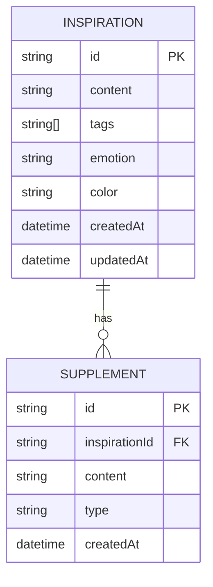

## 1. Architecture Design

```mermaid
graph TB
    subgraph "Frontend (Vue 3)"
        A[App.vue] --> B[Router]
        B --> C[Pages]
        C --> D[Components]
        D --> E[Composables]
        E --> F[LocalStorage]
    end
    
    subgraph "External Services"
        G[AI APIs]
        H[Font Services]
    end
    
    F &lt;--&gt; G
    A &lt;--&gt; H
```

## 2. Technology Description
- Frontend: Vue@3 + TypeScript + Vue Router + Tailwind CSS
- Initialization Tool: vite-init with vue-ts template
- Storage: LocalStorage (IndexedDB 备选)
- AI Integration: 支持接入国内主流AI模型 API (如文心一言、通义千问、智谱AI等)
- Build Tool: Vite

## 3. Route Definitions
| Route | Purpose |
|-------|---------|
| / | 灵感捕捉页 - 快速记录新灵感 |
| /collection | 灵感集页 - 浏览和管理所有灵感 |
| /inspiration/:id | 灵感详情页 - 查看灵感详情和AI分析 |
| /serendipity | 拾遗页 - 随机展示过往灵感 |

## 4. Data Model

### 4.1 Data Model Definition



### 4.2 Data Types (TypeScript)

```typescript
interface Inspiration {
  id: string
  content: string
  tags: string[]
  emotion: 'excited' | 'calm' | 'curious' | 'anxious' | 'neutral'
  color: string
  createdAt: Date
  updatedAt: Date
  supplements: Supplement[]
}

interface Supplement {
  id: string
  content: string
  type: 'thought' | 'link' | 'progress' | 'note'
  createdAt: Date
}

interface AIAnalysis {
  summary: string
  keywords: string[]
  categories: string[]
  suggestions: string[]
}

interface AIConfig {
  provider: 'wenxin' | 'tongyi' | 'zhipu' | 'custom'
  apiKey: string
  model?: string
}
```

## 5. Composables (Reusable Logic)

| Composable | Purpose |
|------------|---------|
| useInspiration | 灵感的 CRUD 操作 |
| useStorage | 本地存储封装 |
| useAI | AI 分析功能 |
| useSerendipity | 随机灵感逻辑 |
| useTheme | 主题和配色管理 |

## 6. Component Structure

```
src/
├── components/
│   ├── InspirationCard.vue
│   ├── InspirationInput.vue
│   ├── TagSelector.vue
│   ├── EmotionPicker.vue
│   ├── ColorPicker.vue
│   ├── AIAnalysisPanel.vue
│   ├── SupplementList.vue
│   ├── SupplementForm.vue
│   └── SerendipityCard.vue
├── pages/
│   ├── CapturePage.vue
│   ├── CollectionPage.vue
│   ├── DetailPage.vue
│   └── SerendipityPage.vue
├── composables/
│   ├── useInspiration.ts
│   ├── useStorage.ts
│   ├── useAI.ts
│   ├── useSerendipity.ts
│   └── useTheme.ts
├── types/
│   └── index.ts
├── utils/
│   ├── ai.ts
│   ├── storage.ts
│   └── helpers.ts
├── App.vue
└── main.ts
```

## 7. AI Integration Strategy

### 7.1 Supported Providers
- 百度文心一言 (ERNIE)
- 阿里云通义千问 (Qwen)
- 智谱AI (GLM)
- 自定义 API 端点

### 7.2 Prompt Template
```
请分析以下灵感内容，提供：
1. 简洁的总结（50字以内）
2. 3-5个关键词
3. 2-3个可能的分类标签
4. 1-2个发展建议

灵感内容：
{content}
```

### 7.3 Response Format
```json
{
  "summary": "总结内容",
  "keywords": ["关键词1", "关键词2"],
  "categories": ["分类1", "分类2"],
  "suggestions": ["建议1", "建议2"]
}
```
