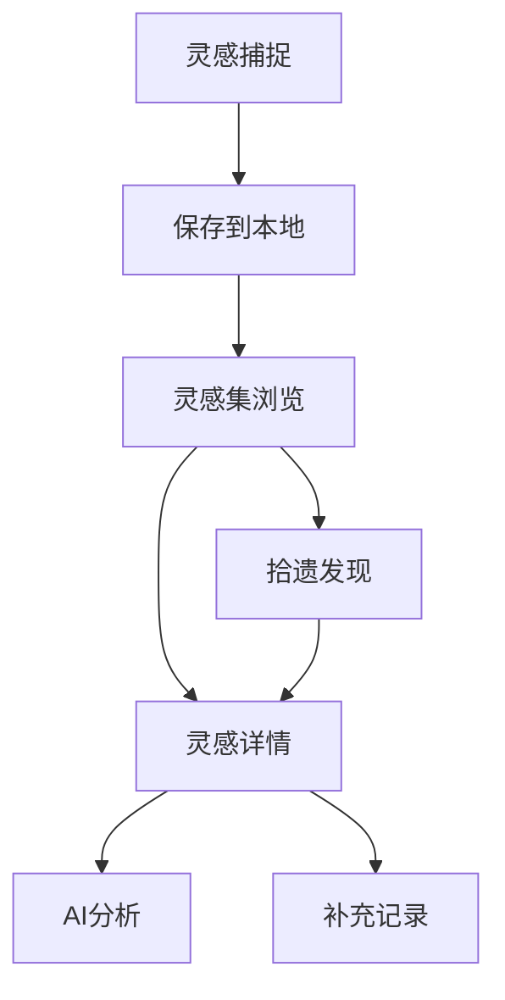

## 1. Product Overview
一个独特的灵感记录应用，专注于捕捉那些转瞬即逝的创意火花，提供AI智能分析和惊喜的"拾遗"体验。
- 解决灵感容易被遗忘的问题，为创意工作者、设计师、创业者等提供快速记录和深度分析工具
- 通过独特的视觉设计和交互体验，与市面现有产品形成明显差异化

## 2. Core Features

### 2.1 User Roles (if applicable)
| Role | Registration Method | Core Permissions |
|------|---------------------|------------------|
| 普通用户 | 本地存储 (无需注册) | 完整功能使用，数据存储在本地 |

### 2.2 Feature Module
1. **灵感捕捉页**: 快速记录灵感，添加标签和情感色彩
2. **灵感集页**: 浏览所有灵感，支持筛选、搜索和排序
3. **灵感详情页**: 查看完整灵感，AI分析总结，添加补充记录
4. **拾遗页面**: 随机展示过往灵感，带来意外发现的惊喜

### 2.3 Page Details
| Page Name | Module Name | Feature description |
|-----------|-------------|---------------------|
| 灵感捕捉页 | 快速记录 | 支持文本、标签、情感标记、时间戳记录 |
| 灵感捕捉页 | 视觉设计 | 动态背景，流畅的输入体验 |
| 灵感集页 | 灵感列表 | 卡片式布局，按时间/标签筛选 |
| 灵感集页 | 搜索功能 | 全文搜索灵感内容和标签 |
| 灵感详情页 | AI分析 | 接入国内AI模型进行智能总结和关键词提取 |
| 灵感详情页 | 补充记录 | 支持添加后续思考、发展、相关链接等 |
| 拾遗页面 | 随机灵感 | 动画过渡展示随机灵感，支持"换一个"功能 |

## 3. Core Process
用户在灵感迸发时打开应用快速记录 → 灵感自动保存到本地存储 → 随时可在灵感集页浏览和管理 → 选择感兴趣的灵感查看详情并获得AI分析 → 不定期使用拾遗功能发现被遗忘的精彩创意

## 4. User Interface Design
### 4.1 Design Style
- 主色调：深邃紫 (#6366f1) 搭配温暖橙 (#f59e0b)，营造创意氛围
- 辅助色：柔和粉 (#ec4899)、清新蓝 (#0ea5e9)
- 按钮风格：圆角矩形，带有微妙的阴影和悬停效果
- 字体：使用 Noto Sans SC 中文显示，搭配 Playfair Display 标题字体
- 布局风格：卡片式网格布局，强调层次和呼吸感
- 图标/emoji风格：使用圆润的线性图标，适当加入创意emoji

### 4.2 Page Design Overview
| Page Name | Module Name | UI Elements |
|-----------|-------------|-------------|
| 灵感捕捉页 | 输入区域 | 全屏沉浸式体验，大文本输入框，流畅的打字动画 |
| 灵感捕捉页 | 快速操作 | 浮动按钮，标签选择器，情感色彩选择 |
| 灵感集页 | 卡片网格 | 瀑布流卡片布局，每张卡片有独特的视觉风格 |
| 灵感集页 | 筛选栏 | 顶部标签筛选，搜索框，排序选项 |
| 灵感详情页 | 详情视图 | 优雅的排版，灵感内容突出显示，AI分析区域有渐变背景 |
| 拾遗页面 | 随机展示 | 全屏动画展示，卡片翻转效果，惊喜过渡动画 |

### 4.3 Responsiveness
- 采用移动端优先设计，完美适配手机、平板和桌面
- 触摸优化：大点击区域，流畅的滑动手势
- 响应式布局：在不同屏幕尺寸下自动调整卡片数量和排列

### 4.4 Animation & Interactions
- 页面切换：使用平滑的滑动和淡入淡出动画
- 灵感卡片：悬停时的微妙上浮和阴影加深
- 拾遗体验：3D翻转效果，随机出现的位置
- 输入反馈：打字时的字符动画，保存时的确认动效
